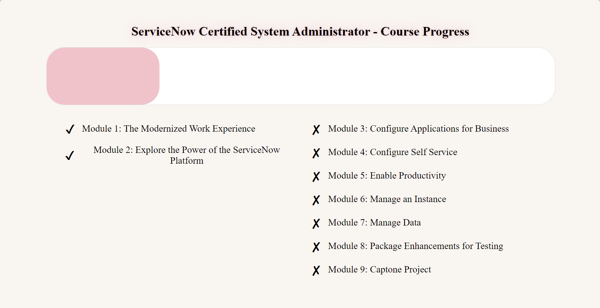

# ServiceNow Certified System Administrator - Course Progress

## Description

In pursuit of mastering the ServiceNow platform through a self-directed course, I have created a very simple visual Course Progress Tracker to motivate and monitor my learning journey. As a visual learner, the need for a tangible representation of my progress became apparent. This project, built with React, is a dynamic and engaging way for me to visualize completion through a progress bar and a list of modules. The tracker encourages consistent engagement and advancement in my studies. My goal is to not only learn but also to prepare myself for future opportunities working with ServiceNow, and this tool just a step in my educational and professional development.

## Tools

- React: For building dynamic UIs.
- CSS: For custom styling and layout.
- Vite: As a fast and efficient build tool.
- Git: For version control and tracking changes.

## See it here!
[Deployed Application](https://mmw18.github.io/NowLearning-CSA-Tracker/)

